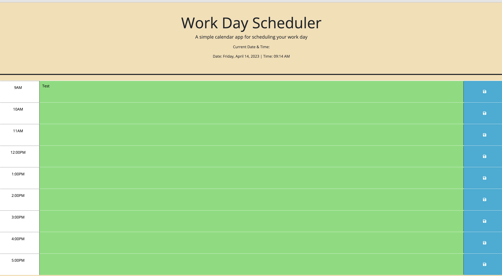

Weekly Scheduler
## Description

Create a simple calendar application that allows a user to save events for each hour of the day by modifying starter code. This app will run in the browser and feature dynamically updated HTML and CSS powered by jQuery.
Use the [Day.js](https://day.js.org/en/) library to work with date and time. This assignment was to showcase how to use the stater code which I didn't maniplulate because it already shows the boxes, buttons and header for the scheduler.
For this task, the goal is for the user to click on the generate password button, go through a series of questions / prompts coded by the coder and then output a random password for the user!

## Usage

For this task, JS or Javascript file was specifically utlized and manipulated. We learned Jquery for this module and Jquery allowed us to use Javascript shortcuts as I like to call them for simplistic purposes. The idea is to make sure first when I see this we have times from 9am-5pm. For the starter code it was I belive from 9am-1pm. First, I went into inspect element and reviewed what Id and class is and where is it. Form there, I ended up copyinh and pasting the following code:  
                                                                       
  
                                                                        
11AM

                                                                     <textarea class="col-8 col-md-10 description" rows="3"> </textarea>
                                                                         <button class="btn saveBtn col-2 col-md-1" aria-label="save">
                                                                                   <i class="fas fa-save" aria-hidden="true"></i>
                                                                                                 </button>
                                                                                                 
 
                                                                                                 
This code had an ID of hour x and a time block class. I copy and pasted till I had enough and as I renamed the ID to hour 12,13,14,etc, the website page added the times for me. 

After that, I took a look at the JS file and comments. I reviwed the jsday libairy documentation and was able to display the date. The time was tricky and needed a few functions and learned about addClass and removeClass which is removing class names from a selected element or adding it back. Form there I wrote a function to run where if function is less than currrent hour point to the nearest object, but my code didn't work the way I wanted to. I need to find a way to change the colors from grey if past, red present, and green future.

From there, I added a local storage with some functions and the logic is when the user clicks on the blue save button, the code will generate the logic of local storaging the code even if the browser is refreshed or closed! This varies depending on computer to computer!

The final thing was adding the real time! This required alot of reasearch and had help from peers and alot of refrencing from our previous module to get this to run. 

The code now runs where when the user inputs a message and clicks save, it says the comments. The date and time are not static and are live.

Refrences

;
;

Website URL!!
https://salzm.github.io/Password-Generator/

Credit : Marni Luka. Worked together and discussed  to implement the date, color, and local storage in JS. Worked with teamates on Discord to make sure to code made sense and see what line of code was doing what when executed.

